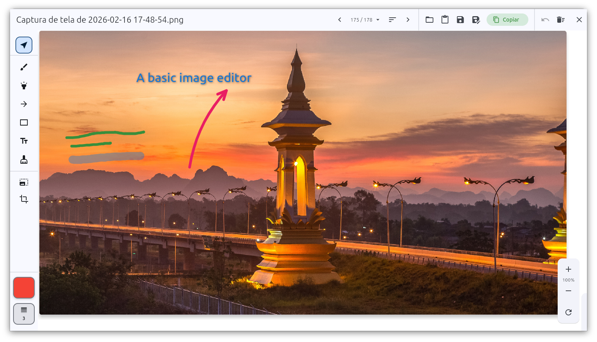

# Linux Image Editor

A lightweight and fast image editor for Linux with drawing tools (brush, highlighter, arrows, shapes), text annotations, crop, resize, and file navigation. Perfect for quick edits after screenshots with keyboard shortcuts support.

Editor de imagens leve e rápido para Linux com ferramentas de desenho (pincel, marca-texto, setas, formas), anotações de texto, corte, redimensionamento e navegação de arquivos. Perfeito para edições rápidas após print screens com suporte a atalhos de teclado.


[English](#english) | [Português](#português)

## English



A feature-rich image editor designed for quick edits. Load images from file or clipboard, annotate with various tools, crop, resize, and save your work—all with intuitive keyboard shortcuts.

### Download Pre-built Package

Download the latest `.deb` package from [Releases](https://github.com/vandreborba/linux_image_editor/releases/latest).

### Install

```bash
sudo dpkg -i linux-image-editor_*.deb
```

### Dependencies

The application requires `xclip` to copy images to the clipboard. If you install using the install script or .deb package, this dependency will be automatically installed. If installing manually:

```bash
sudo apt install xclip
```

### Set as Default Image Viewer

After installing, run the included script to set Linux Image Editor as the default application for opening images:

```bash
/opt/linux-image-editor/set-default.sh
```

This script configures all common image MIME types (PNG, JPEG, GIF, BMP, WebP) to open with Linux Image Editor by default.

---

### Build from Source

#### Build .deb Package

To create a distributable .deb package:

```bash
bash .sh/build-deb.sh
```

This will:
- Clean previous builds
- Compile the Flutter app
- Create a .deb package in `build/deb/`
- Automatically open the folder when done

#### Development

```bash
flutter pub get
flutter run -d linux
```

#### Create GitHub Release

To automatically create a new release with the .deb package on GitHub:

```bash
bash .sh/create-release.sh
```

This script will:
- Update version in `build-deb.sh`
- Create commit and tag
- Push to GitHub
- GitHub Actions will automatically build and publish the release

See [Release Guide](.github/RELEASE_GUIDE.md) for details.

### License

GPL-3.0. See LICENSE.

## Português


Um editor de imagens completo projetado para edições rápidas. Carregue imagens de arquivos ou da área de transferência, anote com várias ferramentas, corte, redimensione e salve seu trabalho—tudo com atalhos de teclado intuitivos.

### Baixar Pacote Pré-compilado

Baixe o pacote `.deb` mais recente em [Releases](https://github.com/vandreborba/linux_image_editor/releases/latest).

### Instalar

```bash
sudo dpkg -i linux-image-editor_*.deb
```

### Dependências

O aplicativo necessita do `xclip` para copiar imagens para a área de transferência. Se você instalar usando o script de instalação ou o pacote .deb, essa dependência será instalada automaticamente. Se instalar manualmente:

```bash
sudo apt install xclip
```

### Definir como Visualizador de Imagens Padrão

Após instalar, execute o script incluído para definir o Linux Image Editor como aplicativo padrão para abrir imagens:

```bash
/opt/linux-image-editor/set-default.sh
```

Este script configura todos os tipos MIME de imagens comuns (PNG, JPEG, GIF, BMP, WebP) para abrir com o Linux Image Editor por padrão.

---

### Compilar do Código Fonte

#### Criar Pacote .deb

Para criar um pacote .deb distribuível:

```bash
bash .sh/build-deb.sh
```

Isso vai:
- Limpar builds anteriores
- Compilar o app Flutter
- Criar um pacote .deb em `build/deb/`
- Abrir a pasta automaticamente ao finalizar

#### Desenvolvimento

```bash
flutter pub get
flutter run -d linux
```

#### Criar Release no GitHub

Para criar automaticamente uma nova release com o pacote .deb no GitHub:

```bash
bash .sh/create-release.sh
```

Este script vai:
- Atualizar a versão no `build-deb.sh`
- Criar commit e tag
- Fazer push para o GitHub
- O GitHub Actions construirá e publicará a release automaticamente

Veja o [Guia de Release](.github/RELEASE_GUIDE.md) para mais detalhes.

### Licença

GPL-3.0. Veja LICENSE.
